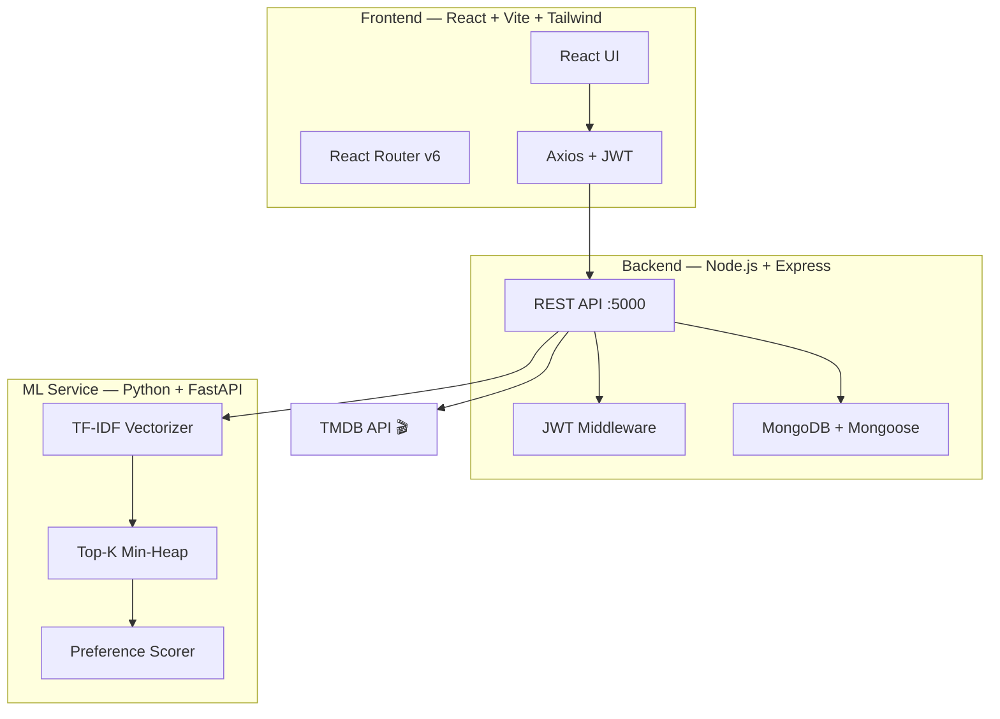

# CineMatch — AI-Powered Personalized Movie & TV Recommendation Platform

> An end-to-end portfolio project demonstrating full-stack development, machine learning, NLP/recommendation systems, and DSA — focused on Indian cinema with international support.

---

## Architecture Overview



## Tech Stack

| Layer | Technology |
|-------|-----------|
| Frontend | React 18, Vite 5, Tailwind CSS v4, React Router v6, Axios |
| Backend | Node.js, Express.js, JWT, bcrypt |
| Database | MongoDB, Mongoose ODM |
| ML Service | Python, FastAPI, Scikit-learn, Pandas, NumPy |
| Data Source | TMDB API |

## Features

- 🎯 **Personalized Recommendations** — TF-IDF + cosine similarity + user preference vectors
- 🇮🇳 **Indian Cinema Focus** — Sandalwood, Tollywood, Kollywood, Mollywood, Bollywood, and more
- 🧠 **Real-time Preference Learning** — Every rating immediately updates your preference vector
- 📊 **Explainable Recommendations** — Every suggestion comes with a reason
- 🔄 **Feedback Loop** — Watched/Interested/Not Interested signals improve recommendations
- 🔍 **Search & Browse** — Filter by language, industry, genre, rating, year
- 📱 **Responsive Design** — Dark cinematic theme, mobile-first

## Recommendation Algorithm

```
score =
  0.25 × contentSimilarity   (TF-IDF cosine similarity)
+ 0.15 × languageMatch       (preferred language match)
+ 0.20 × genreMatch          (weighted genre preferences)
+ 0.20 × actorMatch          (weighted actor preferences)
+ 0.10 × directorMatch       (weighted director preferences)
+ 0.05 × popularityScore     (normalized TMDB popularity)
+ 0.05 × ratingScore         (normalized TMDB rating)
```

## DSA Integration

### Top-K Heap Ranking (Min-Heap)
- **Why**: Given N=2000+ candidate media items, finding top 10 using a min-heap is O(N log K) vs O(N log N) for full sort
- **Implementation**: `ml-service/app/recommender/topk_heap.py`

### HashMap / HashSet Usage
- Genre, actor, director lookups: **O(1)** via Python `dict` / MongoDB `Map`
- Recommendation deduplication: **O(1)** via `set`
- User preference vector: **O(1)** key-value access

## Database Schema

```
users          → preferences.genres (Map), actors (Map), directors (Map)
media          → cast[], directors[], keywords[], featureText (TF-IDF input)
interactions   → action: watched|rated|interested|not_interested|skipped
recommendations → score, scoreBreakdown, reasons[]
```

## Development Phases

| # | Phase | Status |
|---|-------|--------|
| 1 | Project Setup & Structure | ✅ Complete |
| 2 | TMDB Data Ingestion | ✅ Script Ready |
| 3 | MongoDB Models | ✅ Complete |
| 4 | Authentication (JWT + bcrypt) | ✅ Complete |
| 5 | Language/Industry Onboarding | 🔄 UI started |
| 6 | Movie Rating Onboarding | ⏳ Pending |
| 7 | Genre/Actor/Director Preferences | ⏳ Pending |
| 8 | Python ML Engine (TF-IDF) | ⏳ Pending |
| 9 | Node ↔ Python Integration | ⏳ Pending |
| 10 | Recommendation Dashboard | ⏳ Pending |
| 11 | Feedback System | ⏳ Pending |
| 12 | DSA Top-K Ranking | ⏳ Pending |
| 13 | Recommendation Explanations | ⏳ Pending |
| 14 | Search & Media Details | ⏳ Pending |
| 15 | Collaborative Filtering | ⏳ Pending |
| 16 | Testing | ⏳ Pending |
| 17 | Deployment | ⏳ Pending |

## Setup Instructions

### Prerequisites
- Node.js 18+
- MongoDB (local or Atlas)
- Python 3.10+
- TMDB API key (free at themoviedb.org)

### 1. Clone & Environment
```bash
git clone <repo>
cd CineMatch

# Server
cp server/.env.example server/.env
# Edit server/.env and add:
# MONGODB_URI, JWT_SECRET, TMDB_API_KEY, TMDB_ACCESS_TOKEN
```

### 2. Install Dependencies
```bash
# Client
cd client && npm install

# Server
cd server && npm install

# ML Service
cd ml-service && pip install -r requirements.txt
```

### 3. Ingest TMDB Data
```bash
cd CineMatch
node scripts/ingest.js
# Takes 10-20 min, ingests ~1400 movies/shows across 7 languages
# Use --dry-run to test without saving
```

### 4. Run Development Servers
```bash
# Terminal 1 — Client
cd client && npm run dev    # http://localhost:3000

# Terminal 2 — Server
cd server && npm run dev    # http://localhost:5000

# Terminal 3 — ML Service (Phase 8+)
cd ml-service && uvicorn app.main:app --reload --port 8000
```

## API Reference

| Method | Endpoint | Auth | Description |
|--------|----------|------|-------------|
| POST | `/api/auth/register` | ❌ | Create account |
| POST | `/api/auth/login` | ❌ | Login + JWT |
| GET | `/api/auth/me` | ✅ | Current user |
| GET | `/api/media` | ✅ | List media (paginated) |
| GET | `/api/media/search` | ✅ | Search + filters |
| GET | `/api/media/:id` | ✅ | Media details |
| POST | `/api/onboarding/languages` | ✅ | Step 1 |
| POST | `/api/onboarding/ratings` | ✅ | Step 2 |
| POST | `/api/onboarding/genres` | ✅ | Step 3 |
| POST | `/api/onboarding/actors` | ✅ | Step 4 |
| POST | `/api/onboarding/directors` | ✅ | Step 5 |
| GET | `/api/recommendations` | ✅ | Personalized recs |
| GET | `/api/recommendations/similar/:id` | ✅ | Similar media |
| POST | `/api/interactions` | ✅ | Record feedback |
| GET | `/api/users/profile` | ✅ | User profile |

## Project Structure

```
CineMatch/
├── client/                 # React + Vite frontend
│   └── src/
│       ├── components/     # Reusable components
│       ├── pages/          # Route pages
│       ├── context/        # AuthContext
│       ├── services/       # Axios API client
│       └── utils/          # Config, helpers
├── server/                 # Node.js + Express backend
│   └── src/
│       ├── models/         # Mongoose schemas
│       ├── routes/         # Express route handlers
│       ├── middleware/     # JWT auth, error handler
│       └── config/         # DB connection
├── ml-service/             # Python FastAPI ML engine
├── scripts/
│   └── ingest.js           # TMDB data ingestion
└── README.md
```

## ML Evaluation (Phase 16)

- **Precision@K**: Of top K recommendations, how many did the user interact positively with?
- **Recall@K**: Of all items the user liked, how many appear in top K?
- **Hit Rate@K**: Did at least one relevant item appear in top K?

*Note: Recommender evaluation differs from classification metrics. We measure engagement quality, not accuracy.*

---

> This product uses the TMDB API but is not endorsed or certified by TMDB.
